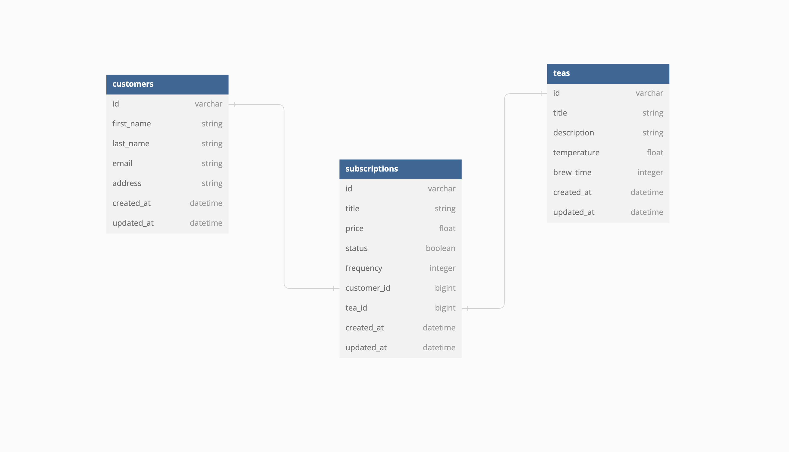

# Tea Subscription Service - API

<p> The Tea Subscription Service API is built on a Service-Oriented-Architechture with the back-end built to expose API endpoints to our front-end development team. We've exposed a number of endpoints to help our customers create new tea subscriptions, cancel subscriptions, and see all of their subscriptions. </p>

## Contributors
- Michael Callahan | [LinkedIn](https://www.linkedin.com/in/michaelcallahanjr/) | | [Github](https://github.com/calforcal) |

## Repo Installation
In your terminal run the following commands to clone the repositories:

**Backend**
          
     git clone git@github.com:calforcal/lunch_and_learn.git

**Ruby and Rails Versions**

    rails 7.0.8
    ruby 3.2.2

**Installing the Gems Locally**

     bundle install

**Testing the Repositories**

#### To run the full test suite:

     bundle exec rspec

## Schema

### Code

<details close>

```
  create_table "customers", force: :cascade do |t|
    t.string "first_name"
    t.string "last_name"
    t.string "email"
    t.string "address"
    t.datetime "created_at", null: false
    t.datetime "updated_at", null: false
  end

  create_table "subscriptions", force: :cascade do |t|
    t.string "title"
    t.float "price"
    t.boolean "status"
    t.integer "frequency"
    t.bigint "customer_id", null: false
    t.bigint "tea_id", null: false
    t.datetime "created_at", null: false
    t.datetime "updated_at", null: false
    t.index ["customer_id"], name: "index_subscriptions_on_customer_id"
    t.index ["tea_id"], name: "index_subscriptions_on_tea_id"
  end

  create_table "teas", force: :cascade do |t|
    t.string "title"
    t.string "description"
    t.float "temperature"
    t.integer "brew_time"
    t.datetime "created_at", null: false
    t.datetime "updated_at", null: false
  end

  add_foreign_key "subscriptions", "customers"
  add_foreign_key "subscriptions", "teas"
```

</details>

### DB Design Image

<details close>



</details>

## Endpoints

### Create a Subscription

<details close>

```http
POST /api/v1/customers/:id/subscriptions
```

#### Parameters

```
:id => customer_id
```

| Code | Description |
| :--- | :---------- |
| 201  | `CREATED`        |

#### Request Body

```json
{
  "title": "Summer Tea",
  "price": 200.00,
  "status": true,
  "frequency": "weekly",
  "tea_id": 2
}
```

#### Example Response

```json
{
  "id": "1",
  "type": "subscription",
  "attributes": {
    "title": "Summer Tea",
    "price": 200.00,
    "status": true,
    "frequency": "weekly",
    "tea_id": 2,
    "customer_id": 1
  }
}
```

##### Error Response

| Code | Description |
| :--- | :---------- |
| 404  | `Record not found.` |

```json
{
  "Error": "Invalid request. Please try again.",
  "Status": 404
}
```

| Code | Description |
| :--- | :---------- |
| 400  | `Bad request.` |

```json
{
  "Error": "Invalid request. Please try again.",
  "Status": 400
}
```

</details>

### Cancel a Subscription

<details close>

```http
PATCH /api/v1/customers/:customer_id/subscriptions/:subscription_id
```

#### Parameters

```
:customer_id => customer_id
:subscription_id => subscription_id
```

| Code | Description |
| :--- | :---------- |
| 201  | `CREATED`        |

#### Request Body

```json
{
  "status": false
}
```

#### Example Response

```json
{
  "id": "1",
  "type": "subscription",
  "attributes": {
    "title": "Summer Tea",
    "price": 200.00,
    "status": false,
    "frequency": "weekly",
    "tea_id": 2,
    "customer_id": 1
  }
}
```

##### Error Response

| Code | Description |
| :--- | :---------- |
| 404  | `Record not found.` |

```json
{
  "Error": "Invalid request. Please try again.",
  "Status": 404
}
```

</details>

### Get all Subscriptions (cancelled/active)

<details close>

```http
GET /api/v1/customers/:id/subscriptions
```

#### Parameters

```
:id => customer_id
```

| Code | Description |
| :--- | :---------- |
| 200  | `OK`        |

#### Example Response

```json
{
"data": [
    {
      "id": 3,
      "type": "subscription",
      "attributes": {
        "title": "Vietnamese",
        "price": 662733.28,
        "status": false,
        "frequency": "monthly",
        "tea_id": 10,
        "customer_id": 3
      }
    },
    {
      "id": 7,
      "type": "subscription",
      "attributes": {
        "title": "Bai Mu Dan",
        "price": 536427.38,
        "status": false,
        "frequency": "monthly",
        "tea_id": 2,
        "customer_id": 3
      }
    }
  ]
}
```

##### Error Response

| Code | Description |
| :--- | :---------- |
| 404  | `Record not found.` |

```json
{
  "Error": "Invalid request. Please try again.",
  "Status": 404
}
```

</details>